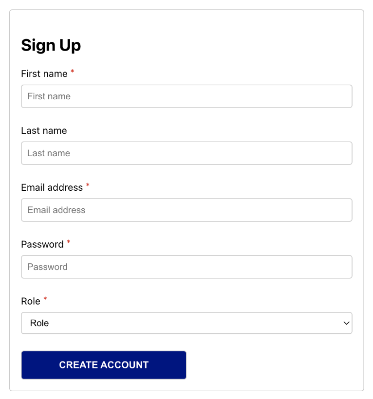

# react-registration-form
This project builds upon the Coursera React Advanced by Meta; registration form, incorporating improvements, debugging solutions, and enhanced validation features. The code is well-commented for better understanding and follows programmer-friendly patterns.

**Author:** Yasas Banuka Malavige 

**Description:**

This project builds upon the Coursera React Advanced by Meta; registration form, incorporating improvements, debugging solutions, and enhanced validation features. The code is well-commented for better understanding and follows programmer-friendly patterns.

**Key Improvements:**

* **Debugging:** Resolved issues that caused the submit button to remain disabled even with valid data.
* **Enhanced Validation:** Added email validation during input to provide immediate feedback to users.
* **Detailed Comments:** Improved code comments for clarity and maintainability.
* **Programmer-Friendly Patterns:** Adhered to best practices and code patterns for better structure and readability.

**Getting Started:**

1. **Clone or Download the Repository:** Access this project's code through your preferred method (e.g., Git clone or download).
2. **Install Dependencies:** Open your terminal or command prompt and navigate to the project's root directory. Run the `npm install` command to install the necessary dependencies
3. **Run the Application:** Open your terminal and navigate to the project's root directory. Execute `npm start` to initiate the development server

   
**Enjoy!**

The application should launch in your default browser, ready for use with the enhanced features.

**Additional Notes:**

* Feel free to modify or extend the code based on your specific needs.
* The codebase adheres to recommended practices for React development.
* The provided comments serve as a valuable guide for understanding the code's functionality.

**Contributing:**

Feel free to fork this repository and contribute your own enhancements or bug fixes. We welcome community engagement to further refine this project.

**Happy Coding!**

